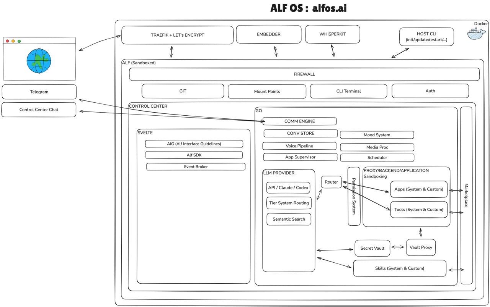

# ALF

A personal AI assistant that lives in your Telegram chats. Built in Go. Runs on your hardware.

ALF connects an LLM of your choice to your messaging, wraps it with semantic long-term memory, configurable response tiers, voice transcription, and a web dashboard — all in a single Docker container you control.

> **Note — 0.8.0 development window.** The `release/0.8.0` branch is mid-migration toward the object-capability model described in [`docs/ARCHITECTURE-SECURITY.md`](docs/ARCHITECTURE-SECURITY.md) §3.1. The legacy process sandbox (chroot+setpriv+bwrap on Linux) has been **razed** (ticket [#406](https://github.com/alamparelli/alf/issues/406)); the ocap forge that replaces it lands in [#391](https://github.com/alamparelli/alf/issues/391) and [#386](https://github.com/alamparelli/alf/issues/386). Daemon builds from this branch **refuse to start** without `ALF_EXPERIMENTAL=1` set, log a multi-line banner at boot, and tag every Control Center response with `X-ALF-Experimental: no-isolation`. Do not run development-branch builds on shared or production hosts. Stable releases continue to track the tags in `release/0.7.x`.

## Why ALF

Most AI assistant frameworks are Node.js monoliths with hundreds of dependencies. ALF is different:

- **Go binary, zero JS runtime** — single static binary, minimal attack surface, no `node_modules` supply chain
- **Semantic memory** — Go-native ONNX embeddings (sqlite-vec + FTS5) for real long-term recall, not just context window tricks
- **Persistent classifier** — a long-lived classifier process handles message routing in ~0ms instead of spawning a new one per message
- **Tier system** — configurable response tiers (model, tools, effort, read/write access) routed by an LLM classifier
- **Defense-in-depth security** — non-root daemon (uid 1001), LLM subprocess isolated as uid 1000 with zero capabilities, read-only config, restricted tool execution
- **Backend-agnostic** — three backend families, mixable per tier:
  - **CLI**: Claude Code (Claude Pro/Max subscription) or OpenAI Codex (ChatGPT Plus + GPT-5-codex)
  - **API**: any OpenAI-compatible HTTP API (OpenRouter for 200+ models, OpenAI, Groq, Anthropic API, …)
  - **Local**: Ollama (any local model, no API key)
- **Subscription-friendly** — run on a flat-rate subscription (Claude Pro/Max, ChatGPT Plus) instead of pay-per-token, or go fully local with Ollama
- **Self-hosted** — your hardware, your data, your rules. No cloud dependency beyond whichever backend you configure

## How it works



**Host CLI** (`alf`) manages the container lifecycle from the host machine. Inside Docker, the **daemon** runs as `alfd` (uid 1001) and serves the Control Center web UI, polls Telegram, and coordinates all subsystems. LLM subprocesses run as `alf` (uid 1000) with restricted permissions and zero capabilities. A sidecar container handles voice transcription (faster-whisper).

### Internal architecture — 5 blocks

ALF's internal code is organised around five first-class concerns:

```
internal/
├── capability/   ← what ALF can execute       (tools + skills + apps)
├── memory/       ← what ALF knows / remembers (conv + embeddings + preferences)
├── ai/           ← the brain that decides     (provider + strategy + ResolveModel)
├── sandbox/      ← the guards that enforce    (firewall + vault + filesystem + integrity)
└── runtime/      ← the conductor              (orchestrates the four)
```

A **Capability** (tool / skill / app) is executed by the **AI**, with graded access to **Memory**, inside a **Sandbox** that enforces a Policy. The **Runtime** orchestrates the four. Everything else is periphery (user-facing consumers under `cli/ controlcenter/ telegram/ voice/ scheduler/`, ops plumbing under `internal/platform/`).

Dependency rules are enforced by CI (`internal/archtest/`): only `runtime/` may import the four inner blocks; consumers depend on `runtime/` alone.

See [`docs/ARCHITECTURE.md`](docs/ARCHITECTURE.md) for the contributor-facing reference and the "where do I put this?" decision tree.

## Quick start

### Prerequisites

- Docker and Docker Compose
- 2 GB RAM minimum
- *Optional:* a [Telegram bot token](https://core.telegram.org/bots#how-do-i-create-a-bot) (via @BotFather) + your chat ID
- *One* of the supported backends: a Claude Pro/Max subscription (for the Claude Code CLI backend), a ChatGPT Plus subscription (for the Codex CLI backend), any OpenAI-compatible API key (OpenRouter, OpenAI, Groq, …), or a local Ollama install

### Install

```sh
curl -fsSL install.alfos.ai | sh
```

### Setup

```sh
alf init
```

The interactive wizard walks you through:
1. Choosing an install directory
2. Configuring Telegram credentials
3. Setting up dashboard access (HTTP or HTTPS with Let's Encrypt)
4. Starting the container
5. Authenticating your chosen backend (Claude CLI, Codex CLI, or API key)

After the container is running, the Control Center **Setup Wizard** guides you through backend selection (CLI, Codex, API / OpenRouter / OpenAI / Ollama / …), tier presets, and optional Telegram configuration — all from the browser.

### After setup

```sh
alf login     # Authenticate the Claude CLI backend inside the container
              # (only needed if you picked the "cli" backend — API / Codex / Ollama
              #  backends authenticate via keys stored in the vault)
alf status    # Check container health
alf logs      # Tail container logs
```

Send a message to your bot on Telegram. That's it.

## Features

### Semantic memory

Alf remembers things across conversations. The memory system uses sqlite-vec for vector similarity search and FTS5 for keyword matching, with Go-native ONNX Runtime inference (all-MiniLM-L6-v2) - no Python dependency for embeddings.

Alf has three memory tools:
- **recall** - hybrid semantic + keyword search over past memories
- **remember** - store facts, preferences, decisions, summaries
- **forget** - remove memories by ID

Memories are automatically recalled when relevant to the current conversation. A batch extractor periodically distills conversation logs into new memories.

### Core instructions

Operational knowledge (Docker environment, filesystem layout, tool discovery, Telegram formatting rules) is compiled into the binary via `go:embed` and injected into every conversation. User-editable files (`soul.md`, `index.md`) handle personality and preferences only - clean installs behave correctly out of the box.

### Configurable tiers

Define response tiers with different capabilities:

| Property | What it controls |
|----------|-----------------|
| `backend` | Which backend serves this tier (`cli`, `codex`, or a configured API backend) |
| `model` | Model ID for the chosen backend (e.g. `sonnet`, `gpt-4o`, `llama3`) |
| `effort` | Thinking / reasoning effort (`low`, `medium`, `high`) |
| `tools` | Available tools for the session |
| `write_capable` | Whether the model is allowed to modify files |
| `max_turns` | Agentic loop depth |
| `instant` | Router responds directly (no second LLM call) |

The LLM classifier reads your message and picks the right tier. Greetings get instant cheap-model responses. Complex tasks get multi-turn deep-model sessions with full tool access.

### Multi-backend support

ALF ships with three backend families and you can mix them per tier:

- **CLI backend** — routes through a locally-installed CLI. Two providers supported: **Claude Code** (uses your Claude Pro / Max / Team subscription, flat rate) and **OpenAI Codex** (uses your ChatGPT Plus subscription with `codex exec` for GPT-5-codex).
- **API backend** — any OpenAI-compatible HTTP endpoint. Pre-configured presets for **OpenRouter** (200+ models via a single key), **OpenAI** (GPT-4o / o1 / o3 / …), **Anthropic API** (direct Claude API), and you can register any custom `base_url`.
- **Local backend** — **Ollama**. Any locally-hosted model, zero API key, zero cost.

Conversation context flows seamlessly across backend switches — a tier running on Ollama and another running on Claude CLI can share the same conversation history. See [backends documentation](internal/controlcenter/docs/backends.md) for the full configuration reference.

### Voice transcription

Send a voice message on Telegram. ALF transcribes it via the whisper-service container and processes the text as a regular message. The whisper-service runs faster-whisper and is deployed as a separate Docker container, keeping the main ALF image lean.

### Media processing

- **Images** — forwarded to the model's vision capabilities (when the backend supports it)
- **Videos/GIFs** — frame extraction into contact sheets + audio transcription
- **PDFs** — text extraction via pdftotext
- **Documents** — passed through to the model with appropriate context

### Skills & tools

ALF discovers CLI tools and skills at boot. System tools live in `tools.d/` (read-only), user tools in `tools/`. Same pattern for skills (`skills.d/`, `skills/`). All tools support `--help` - ALF runs it before first use. Missing a capability? Drop an executable in `tools/` or a skill definition in `skills/`.

### Agent teams

ALF can coordinate multiple specialized agents for complex tasks. An **orchestrator** (Opus) breaks down requests, delegates sub-tasks to agents (researcher, writer, reviewer...), reviews results, and synthesizes a final answer. Agents work in isolated sessions - no context bleeds between them.

Teams are defined as JSON files in `config.d/agents/`. A bundled "starter" team ships with ALF. Invoke by asking ALF to "use agents" or "lance les agents", or schedule with `--tier agent`.

### Scheduler

Cron-based job scheduling with timezone support. Four execution modes:

- **LLM jobs** - run a prompt through any tier (`--tier sonnet --prompt "..."`)
- **Direct jobs** - execute bash commands (`--tier direct --command "df -h"`)
- **Orchestrator jobs** - coordinate multiple agents (`--tier orchestrator --prompt "..."`)
- **Reminders** - send a message directly to Telegram (`--message "Stand up!"`)

Configurable per-job timeouts. Execution logs recorded for every run. Daily digest summarizes job results. Skill injection via `--skills` flag.

### Control Center

Web dashboard at port 8080 with sidebar navigation:

- **Chat** - web-based chat with SSE streaming, media upload, reactions, multiple conversation tabs, markdown rendering
- **Home** - workspace file explorer, teach (memory ingestion), admin actions
- **Terminal** - interactive shell session inside the container
- **Tasks** - monitor and launch agent tasks, approve/reject, delete completed tasks
- **Schedules** - create, edit, and monitor scheduled jobs with execution logs and filters
- **Logs** - daemon logs with search and session-based filtering
- **Tiers** - configure response tiers in real-time
- **Firewall** - network firewall rules for outbound access (log-only or enforce mode)
- **Vault** - secrets vault with OAuth2 browser flow, file storage, service credentials
- **Settings** - configuration editor, Telegram setup, backend registration
- **Docs** - built-in documentation
- **Apps** - self-contained apps generated by ALF with optional background services, auto-discovered in the sidebar

Supports dark/light themes (default, catppuccin, sage) and a mobile-first responsive layout with bottom navigation bar. Authentication via Telegram magic link (`/login` command) or bearer token with session cookies. Issuing a new magic link revokes all previous sessions. IP ban after repeated auth failures (configurable threshold and duration).

### Conversation engine

A unified conversation store captures rich message history (text, tool calls, tool results, thinking blocks) in a JSONL ring buffer. Context is preserved across backend switches - switching from a CLI tier to an API tier mid-conversation carries history forward automatically.

### Force commands & session locking

Tiers with `force_command: true` can be invoked directly (e.g., `/opus analyze this`). The session locks to that tier for all subsequent messages until `/new` or session timeout. You can also lock without sending a message (`/opus` alone).

### Reaction-based learning

Emoji reactions on messages (positive or negative) trigger behavioral learning. Negative reactions prompt ALF to ask what went wrong and extract learnings. Positive reactions reinforce good behaviors.

### App framework

ALF can generate self-contained web apps in `data/apps/`. Each app gets a sidebar entry, CSP-sandboxed serving, and optional background services supervised by the daemon (auto-restart on crash, exponential backoff).

### Onboarding

First-time users get an automatic onboarding prompt injected into their first conversation. The `/start` Telegram command re-triggers it. The Control Center Setup Wizard guides backend and tier configuration from the browser.

### Daily mood

ALF has a rotating personality layer - 16 moods (sharp, philosophical, sardonic, playful, grumpy, zen, detective...) that cycle based on the date. This affects tone, not capability.

## CLI reference

```
alf init          Interactive setup wizard (Docker setup, secrets)
alf start         Start the container
alf stop          Stop the container
alf restart       Restart the container
alf upgrade       Pull latest image and restart (update alias works too)
alf login         Authenticate the Claude CLI backend inside the container (only for "cli" backend; API/Codex/Ollama authenticate via the vault)
alf status        Show container status and versions
alf logs          Tail container logs
alf secret        Manage secrets (list, set, remove)
alf magic-link    Generate a Control Center login link
alf token         Print the Control Center bearer token
alf token reset   Generate a new bearer token
alf compose       Regenerate docker-compose.yml from saved profile
alf uninstall     Remove ALF and its data
alf version       Print version
```

## Security model

The entrypoint runs as root for package installation and permission setup, then drops to `alfd` (uid 1001) via `setpriv` with minimal capabilities (setuid, setgid, sys_admin, sys_chroot, chown). LLM subprocesses run as `alf` (uid 1000) with zero capabilities and a sanitized environment:

- **User separation** - daemon runs as `alfd` (uid 1001), LLM runs as `alf` (uid 1000) with allowlist-only environment
- **Filesystem isolation** - `/opt/alf/config.d/` read-only, `/opt/alf/tools.d/` read+execute only, `/home/alf/data/` read+write
- **Secrets** - Docker secrets mechanism, never in environment variables
- **Security headers** - HSTS, X-Frame-Options DENY, CSP with SRI on CDN dependencies, X-Content-Type-Options nosniff
- **Rate limiting** - 15 req/min global for anonymous requests (600 for authenticated users), 5 req/min on auth endpoints, 30 req/min on terminal/SSH endpoints, CORS on the Control Center API
- **Authentication** - magic link (time-limited, rotating) or bearer token with session cookies
- **Session revocation** - new magic link invalidates all previous sessions
- **IP ban** - after repeated auth failures (configurable threshold and duration)
- **SSRF protection** - vault-proxy blocks requests to private/link-local IP ranges with DNS-level validation
- **Outbound firewall** - HTTP/HTTPS proxy with allow/deny rules per domain
- **Container signing** - all Docker images are signed with [Cosign](https://github.com/sigstore/cosign) using keyless signing via GitHub OIDC, with SBOM attestations (SPDX-JSON)

### Verify image signatures

```bash
# Install cosign
brew install cosign

# Verify alf image
cosign verify ghcr.io/alamparelli/alf:<version> \
  --certificate-identity-regexp="github.com/alamparelli/alf" \
  --certificate-oidc-issuer="https://token.actions.githubusercontent.com"

# Verify whisper-service
cosign verify ghcr.io/alamparelli/whisper-service:<version> \
  --certificate-identity-regexp="github.com/alamparelli/alf" \
  --certificate-oidc-issuer="https://token.actions.githubusercontent.com"

# Verify SBOM attestation
cosign verify-attestation ghcr.io/alamparelli/alf:<version> \
  --certificate-identity-regexp="github.com/alamparelli/alf" \
  --certificate-oidc-issuer="https://token.actions.githubusercontent.com" \
  --type spdxjson
```

## Requirements

- **OS**: Linux or macOS (Docker required)
- **RAM**: 512 MB minimum (2 GB recommended for voice transcription)
- **Disk**: ~800 MB for the Docker image + ~600 MB on first voice message (Whisper model)
- **Network**: outbound HTTPS to Telegram + the API endpoint(s) of the backend(s) you've configured (Anthropic, OpenAI, OpenRouter, Ollama host, …)

## Contributing

See [CONTRIBUTING.md](CONTRIBUTING.md) for development setup, code conventions, and guidelines.

## License

[MIT](LICENSE)
